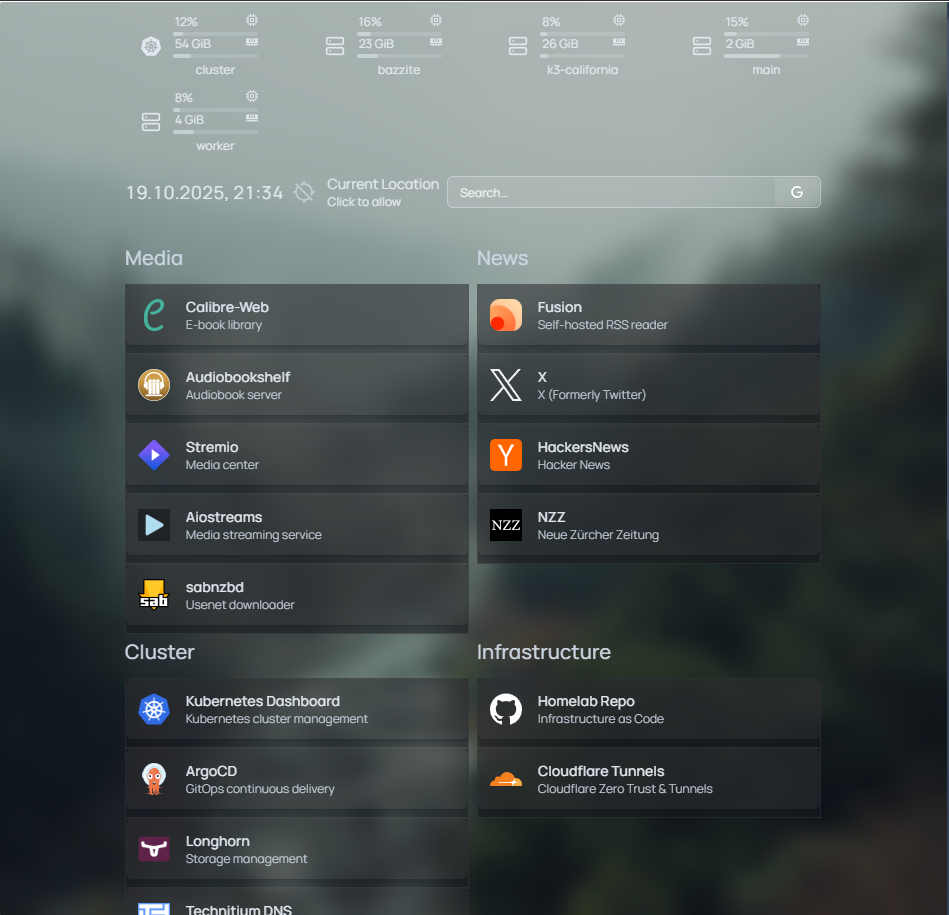

# Laurens Kubernetes Homelab

This repo contains backups, scripts, and documentationfor my hobby and educational [Kubernetes](https://kubernetes.io/) cluster.

The cluster is configured with production like settings such as:

- Automatic fail-over for all deployments and nodes, deployed on: 
    - 5 nodes
    - Across 4 regions
    - Across 2 different providers + my home server
- Ability to target deployment to a geographical location to optimize for latency with automatic fallback or do multi-region deployment
- All data is replicated to two nodes by [Longhorn](https://longhorn.io/) and automatically backed-up to [Cloudflare R2](https://developers.cloudflare.com/r2/)
- CD pipeline through [ArgoCD](https://argo-cd.readthedocs.io/en/stable/). Any changes in the apps folder will automatically be deployed
- [Etcd](https://etcd.io/docs/v3.6/) (the state and configuration of the cluster) is automatically backed-up to [Cloudflare R2](https://developers.cloudflare.com/r2/)
- Ingress is taking care of by [Cloudflare Tunnels](https://developers.cloudflare.com/cloudflare-one/connections/connect-networks/) with one instance per geographical region
- Communication between the nodes is done through [Tailscale](https://tailscale.com/)
- Alle nodes have 0 open, internet facing, ports
- Joining new nodes to the cluster is a ~5 minute job
- Secrets are [encrypted](https://kubernetes.io/docs/tasks/administer-cluster/encrypt-data/) and not stored in this repo ;)
- [Mend Renovate](https://www.mend.io/renovate/) monitors this repo and automatically creates PRs for any software updates

# Screenshots



# Hardware

| location   | ram  | cpu                            | role          | note                   | cost/y |
| ---------- | ---- | ------------------------------ | ------------- | ---------------------- | ------ |
| California | 30GB | 3c (Xeon Silver 4214)          | control plane | High-latency workhorse | $35    |
| London     | 5GB  | 2c (Xeon Gold 6148)            | worker        |                        | $20    |
| London     | 5GB  | 2c (Xeon Gold 6148)            | worker        |                        | $20    |
| Amsterdam  | 8GB  | 2c (Intel Xeon Platinum 8173M) | control plane |                        | $20    |
| Zurich     | 32GB | 4c (Intel N97)                 | control plane | Home Server            | $0     |

Total of 80 GB RAM and 13 CPU cores. You could get that in a single powerful server but not for for ~100 USD/year and where is the fun in that?

# Apps

I'm currently running the following apps:

- aiostreams
- argocd
- audiobookshelf
- calibre-web
- cloudflare
- fusion
- stremio-web
- sabnzbd

# Adding new nodes

## Preparation

1. Copy your ssh key:

```bash
ssh-copy-id root@<IP_ADDRESS> -i ~/.ssh/id_rsa_kubernetes
```

2. Install Tailscale

```
```

## Ansible

Deploy:

```bash
ansible-playbook -i hosts.ini site.yml -u root --private-key ~/.ssh/id_rsa_kubernetes
```

Ansible configures the nodes with the following:

- Automatic updates enabled
- SSH secured and only listening on the tailscale interface
- Firewall pre-configured (not yet enabled due to issues with K8s egress)
- ZRAM activated