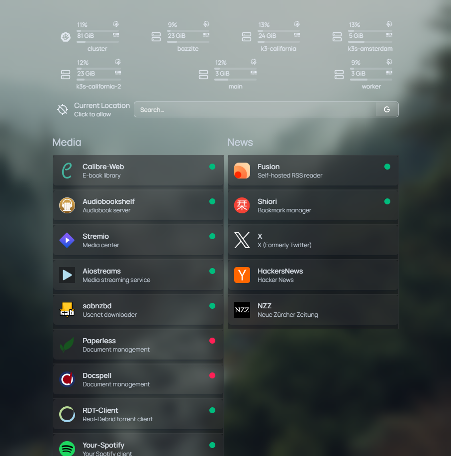
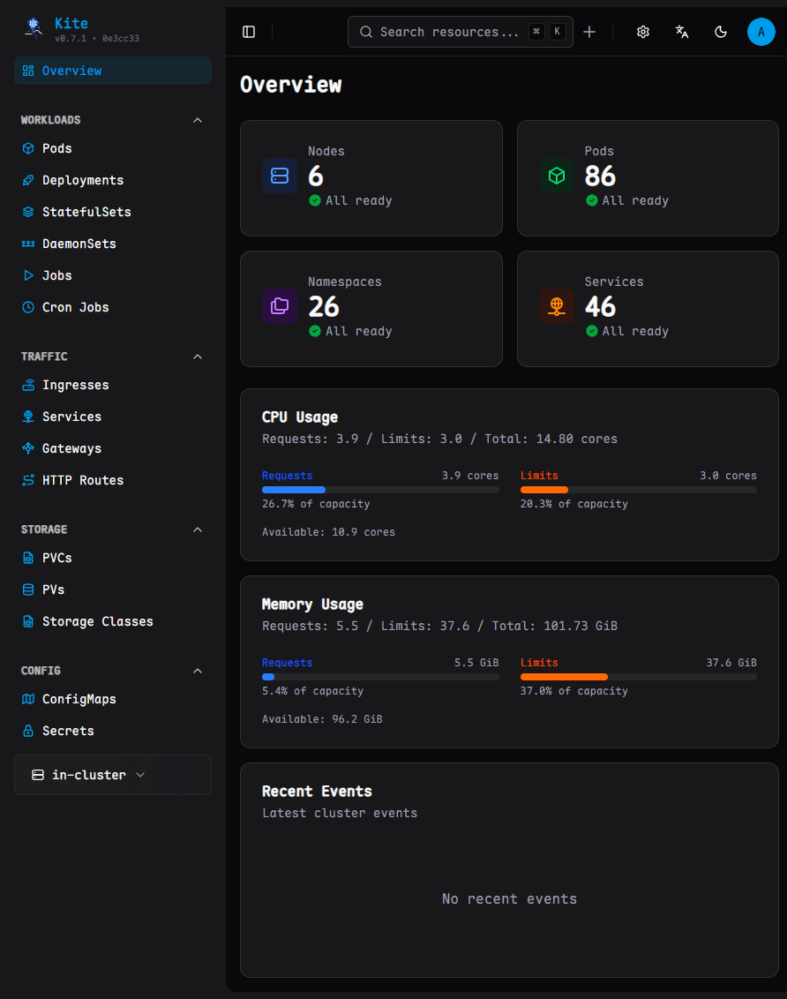
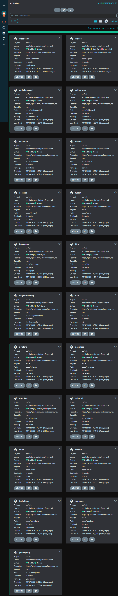

# Laurens Kubernetes Homelab

This repo contains backups, scripts, and documentationfor my hobby and educational [Kubernetes](https://kubernetes.io/) cluster.

The cluster is configured with production like settings such as:

- Automatic fail-over for all deployments and nodes, deployed on: 
    - 7 nodes
    - Across 4 regions
    - Across 3 different providers + my home server
- Ability to target deployment to a geographical location to optimize for latency with automatic fallback or do multi-region deployment
- All data is replicated to two nodes by [Longhorn](https://longhorn.io/) and automatically backed-up to [Backblaze](https://www.backblaze.com/)
- CD pipeline through [ArgoCD](https://argo-cd.readthedocs.io/en/stable/). Any changes in the apps folder will automatically be deployed
- Ingress is taking care of by [Cloudflare Tunnels](https://developers.cloudflare.com/cloudflare-one/connections/connect-networks/) with one instance per geographical region
- Communication between the nodes is done through the wireguard native backed (Running over Tailscale caused double encapsulation and hard to debug issues)
- Joining new nodes to the cluster is a ~5 minute job
- Secrets are [encrypted](https://kubernetes.io/docs/tasks/administer-cluster/encrypt-data/) and not stored in this repo ;)
- [Mend Renovate](https://www.mend.io/renovate/) monitors this repo and automatically creates PRs for any software updates

# Screenshots






# Hardware

| location   | ram  | cpu                            | Storage | role          | note        | cost/y | management url                  |
| ---------- | ---- | ------------------------------ | ------- | ------------- | ----------- | ------ | ------------------------------- |
| California | 30GB | 3c (Xeon Gold 6248)            | NVMe    | worker        |             | $35    | https://master.pandahost.co.uk/ |
| California | 30GB | 3c (Xeon Silver 4214)          | NVMe    | worker        |             | $35    | https://master.pandahost.co.uk/ |
| London     | 5GB  | 2c (Xeon Gold 6148)            | NVMe    | worker        |             | $20    | https://master.pandahost.co.uk/ |
| London     | 5GB  | 2c (Xeon Gold 6148)            | NVMe    | control plane |             | $20    | https://master.pandahost.co.uk/ |
| London     | 8GB  | 4c (AMD EPYC 7542)             | NVMe    | control plane |             | $35    | https://rarecloud.io/clients/   |
| Amsterdam  | 8GB  | 2c (Intel Xeon Platinum 8173M) | SSD     | control plane |             | $20    | https://vps.deluxhost.net/      |
| Zurich     | 32GB | 4c (Intel N97)                 | SSD     | worker        | Home Server | $0     |                                 |

Total of 118 GB RAM and 20 CPU cores. You could get that in a single powerful server but not for for ~100 USD/year and where is the fun in that?

# Apps

I'm currently running the following apps:

- [AIOStreams](https://github.com/Viren070/AIOStreams) - Streaming content aggregator
- [ArgoCD](https://argo-cd.readthedocs.io/en/stable/) - Declarative GitOps CD for Kubernetes
- [Audiobookshelf](https://www.audiobookshelf.org/) - Self-hosted audiobook and podcast server
- [Calibre Web Automated](https://github.com/crocodilestick/Calibre-Web-Automated) - Enhanced version of Calibre web
- [Cloudflare Tunnel](https://developers.cloudflare.com/cloudflare-one/connections/connect-networks/) - Secure ingress to the cluster
- [Docspell](https://docspell.org/) - Document management and archiving system
- [Fusion](https://github.com/0x2E/fusion) - Lightweight RSS Reader
- [Gatus](https://github.com/TwiN/gatus) - Synthetic uptime monitoring and status page
- [Homepage](https://gethomepage.dev/) - A highly customizable homepage/dashboard
- [Kite](https://github.com/zxh326/kite) - Kubernetes dashboard
- [Longhorn](https://longhorn.io/) - Cloud-native distributed block storage for Kubernetes
- [Listenarr](https://github.com/therobbiedavis/Listenarr) - Automated audiobook downloader and library manager
- [n8n](https://n8n.io/) - Workflow automation tool
- [NetAlertX](https://github.com/jokob-sk/NetAlertX) - Network device monitoring and alerting
- [Paperless-ngx](https://docs.paperless-ngx.com/) - Document management system
- [RDT-Client](https://github.com/rogerfar/rdt-client) - Real-Debrid torrent client
- [SABnzbd](https://sabnzbd.org/) - Usenet downloader
- [Shiori](https://github.com/go-shiori/shiori) - Simple bookmark manager
- [Stremio](https://www.stremio.com/) - Media streaming platform
- [Technitium](https://technitium.com/dns/) - DNS server
- [Wanderer](https://github.com/Flomp/wanderer) - Self-hosted trail and route planner
- [Your Spotify](https://github.com/Yooooomi/your_spotify) - Self-hosted Spotify statistics and analytics
- [Listenarr](https://github.com/therobbiedavis/Listenarr) - Audiobook downloader
- [Stacks](https://github.com/zelestcarlyone/stacks) - Download Manager for Anna's Archive
- [Perplexica](https://github.com/ItzCrazyKns/Perplexica) - AI-powered search engine
- [Gatus](https://github.com/TwiN/gatus) - Synthetic uptime monitoring now live
- [SearXNG](https://github.com/searxng/searxng) - Privacy-respecting metasearch engine
- [AIOMetadata](https://github.com/cedya77/aiometadata) - Metadata for Stremio
- [Norish](https://github.com/norish-recipes/norish) - Norish - A realtime, self-hosted recipe app for families & friends
- [IT-Tools](https://github.com/sharevb/it-tools) - Collection of handy online tools for developers, with great UX
- [Stirling PDF](https://github.com/Stirling-Tools/Stirling-PDF) - Stirling PDF is a powerful, open-source PDF editing platform  
- [Obsidian Livesync](https://github.com/vrtmrz/obsidian-livesync) - Live sync for Obsidian

## To Explore

- [ ] [Cloudflare Operator](https://github.com/adyanth/cloudflare-operator) - Cloudflare Tunnel integration for Kubernetes
- [ ] [Dawarich](https://github.com/Freika/dawarich) - Self-hosted alternative to Google Timeline
- [X] [DNS Blocklist](https://github.com/hagezi/dns-blocklists?tab=readme-ov-file#overview) - DNS Blocklist
- [ ] [Github-to-sops](https://github.com/tarasglek/github-to-sops) - Easy way to integrate secrets in GIT
- [ ] [LLocalSearch](https://github.com/nilsherzig/LLocalSearch) - Local AI-powered search engine
- [ ] [Netvisor](https://github.com/mayanayza/netvisor?tab=readme-ov-file) - Netvisor, overview of network and services
- [ ] [Open WebUI](https://github.com/open-webui/open-webui) - User-friendly WebUI for LLMs
- [ ] [Pumpkin](https://github.com/Snowiiii/Pumpkin) - Minecraft server implementation in Rust
- [ ] [Quartz 4](https://quartz.jzhao.xyz/) - Static site generator
- [ ] [Calibre Web Automated Book Downloader](https://github.com/calibrain/calibre-web-automated-book-downloader) - Automatically download (and add) books to Calibre web
- [ ] [daedalOS](https://github.com/DustinBrett/daedalOS) - Desktop enviroment in the browser
- [ ] [VSCode web](https://github.com/coder/code-server) - Web version of VSCode
- [ ] [Khoj](https://github.com/khoj-ai/khoj) - Self-hosted AI second brain
- [ ] [hotpot](https://github.com/erik/hotpot) - Render customizable activity heatmap images from GPS tracks extracted from GPX, TCX, and FIT files. Includes a built-in web server for XYZ tiles and endpoints to add new data via HTTP POST or Strava webhooks.

# Adding new nodes

## Preparation

1. Copy your ssh key:

```bash
ssh-copy-id -i ~/.ssh/id_rsa_kubernetes root@<IP_ADDRESS>
```

2. Install Tailscale

```bash
curl -fsSL https://tailscale.com/install.sh | sh
tailscale up
```
3. Add new node to servers/ansible/hosts.ini

4. Deploy:

```bash
ansible-playbook -i hosts.ini site.yml -u root --private-key ~/.ssh/id_rsa_kubernetes
```

5. Reboot (to ensure that the new mainline kernel is loaded)

6. Connect to cluster:

### Control-plane-node
```bash
curl -sfL https://get.k3s.io | INSTALL_K3S_CHANNEL=latest K3S_TOKEN=<TOKEN> sh -s - server --server https://<IP_ADDRESS_OF_NODE>:6443
```

### Agent
```bash
curl -sfL https://get.k3s.io | INSTALL_K3S_CHANNEL=latest K3S_URL=<IP_ADDRESS_OF_NODE> K3S_TOKEN=<TOKEN> sh -
```

Ansible configures the nodes with the following:

- Automatic security updates enabled and services are automatically restarted (if needed) 
- SSH secured by only listening on the tailscale interface
- Firewall pre-configured (not yet enabled due to issues with K8s egress)
- ZRAM activated
- Network and other tweaks applied to optimize for Kubernetes usage
- K9S, Kubecolor and useful aliases automatically applied

# Tips & Tricks

## ETCDL

```bash
export ETCDCTL_ENDPOINTS="https://100.81.190.71:2379,https://100.79.162.75:2379"
export ETCDCTL_CACERT="/var/lib/rancher/k3s/server/tls/etcd/server-ca.crt"
export ETCDCTL_CERT="/var/lib/rancher/k3s/server/tls/etcd/client.crt"
export ETCDCTL_KEY="/var/lib/rancher/k3s/server/tls/etcd/client.key"
etcdctl member list
```
## Add debug container to pod

```bash
kubectl debug -it my-pod --image=busybox
```

## Run test container on specific node

```bash
kubectl run busybox-bazzite --image=busybox:latest --restart=Never --overrides='{"spec":{"nodeName":"k3s-london-1"}}' -- /bin/sleep 3600
```


